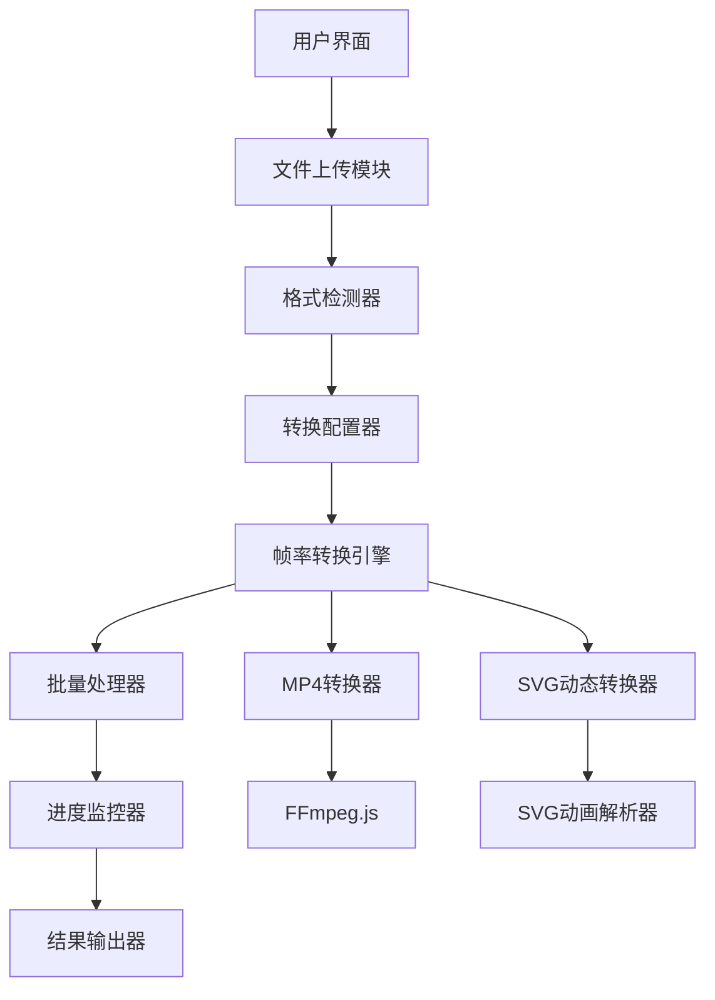
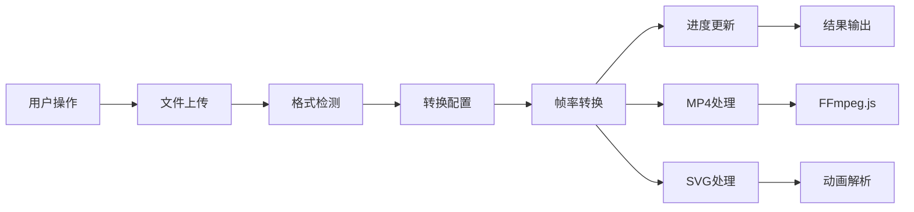

## Product Overview

在现有SVG转换器基础上，新增MP4视频格式和SVG动态格式的帧率转换功能，支持多种帧率选项，保持高质量无损输出，并提供转换进度显示和批量处理支持。

## Core Features

- MP4格式转换：支持30/60/90/120帧率选项
- SVG动态格式转换：支持30/40/60帧率选项
- 高质量无损输出：保持原始画质和流畅度
- 帧率转换优化：确保画面平滑过渡
- 批量处理功能：支持多个文件同时转换
- 转换进度显示：实时显示转换状态和进度
- 格式预览：转换前后效果对比

## Tech Stack

- **前端框架**: React + TypeScript
- **UI组件库**: shadcn
- **视频处理**: FFmpeg.js 或 WebCodecs API
- **SVG处理**: SVGO + 自定义动画帧提取
- **文件处理**: File API + Web Workers
- **状态管理**: React Context + useReducer
- **进度追踪**: 自定义进度条组件
- **批量处理**: Promise.allSettled 并发控制

## System Architecture

## Module Division

- **文件管理模块**: 处理文件上传、格式检测、批量操作
- **转换引擎模块**: 核心帧率转换逻辑，包含MP4和SVG两个子模块
- **进度监控模块**: 实时追踪转换状态，提供进度反馈
- **UI交互模块**: 用户界面、配置选项、结果显示
- **性能优化模块**: Web Workers处理、内存管理、并发控制

## Data Flow

## Design Style

采用现代科技感设计风格，使用深色主题配合渐变色彩，营造专业转换工具的氛围。界面布局清晰，功能分区明确，操作流程直观。

## 页面规划

1. **主页面**: 文件上传区域、转换选项配置、批量处理面板
2. **转换页面**: 实时进度显示、任务队列管理、预览窗口
3. **结果页面**: 转换结果展示、下载管理、质量对比
4. **设置页面**: 高级配置、性能优化、输出偏好

## 页面块设计

### 主页面

- **顶部导航**: Logo、功能切换、用户设置
- **文件上传区**: 拖拽上传、格式提示、批量选择
- **转换配置**: 帧率选择、质量设置、输出格式
- **操作按钮**: 开始转换、清空队列、批量处理

## Agent Extensions

### MCP

- **GitHub MCP Server**
- Purpose: 管理项目代码版本控制和协作开发
- Expected outcome: 建立代码仓库，实现版本管理和团队协作

### SubAgent

- **开发**
- Purpose: 编写生产就绪的转换器核心代码，集成现有项目架构
- Expected outcome: 实现高质量的MP4和SVG帧率转换功能