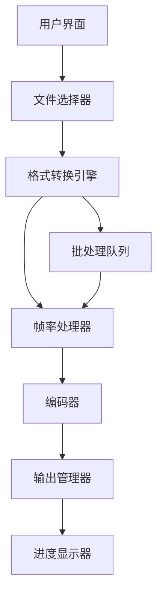

## Product Overview

增强现有SVG转换器，添加MP4视频格式和SVG动态格式的帧率转换功能，支持多种帧率选项和批量处理。

## Core Features

- MP4格式转换：支持30/60/90/120帧率选项
- SVG动态格式转换：支持30/40/60帧率选项
- 高质量无损输出，保持原始画质
- 转换进度实时显示
- 批量文件处理功能
- 帧率转换时的画面平滑优化

## Tech Stack

- Frontend: React + TypeScript
- 图像处理: Canvas API + Web Workers
- 视频编码: FFmpeg.js 或 WebCodecs API
- 状态管理: React Context + useReducer
- 文件处理: File API + Blob
- 进度跟踪: 自定义进度组件
- 批处理队列: Promise队列管理

## System Architecture

## Module Division

- **FileInputModule**: 文件上传和批量选择
- **ConversionEngine**: 核心转换逻辑处理器
- **FrameRateProcessor**: 帧率转换和插值算法
- **VideoEncoder**: MP4编码和SVG动画生成
- **ProgressTracker**: 实时进度监控
- **BatchProcessor**: 批量任务队列管理

## Data Flow

## 设计风格

采用现代科技感的界面设计，深色主题搭配渐变色彩，突出转换器的高性能特性。使用卡片式布局组织功能模块，配合流畅的动画效果和实时数据可视化，营造专业的图像处理工具体验。

## Agent Extensions

### SubAgent

- **开发** (from <subagent>)
- Purpose: 实现高质量的视频编码和帧率转换算法，确保代码集成性和性能优化
- Expected outcome: 生成生产就绪的转换器代码，支持多种格式和帧率的无损转换