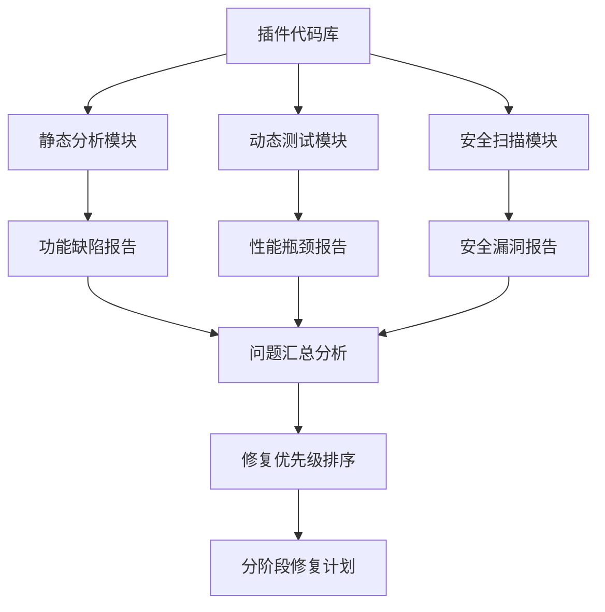

## Product Overview

图像处理浏览器插件的全面评估与修复计划，旨在系统性识别并解决现有插件的功能缺陷、性能瓶颈、用户体验问题和安全漏洞。

## Core Features

- 功能缺陷识别：检测图像处理功能完整性、API调用准确性、错误处理机制
- 性能瓶颈分析：评估图像加载速度、处理算法效率、内存使用情况
- 用户体验问题：分析界面交互流畅性、操作便利性、响应反馈机制
- 安全漏洞扫描：检查数据传输安全、权限使用合理性、代码注入风险
- 分阶段修复计划：按优先级和影响范围制定详细的修复时间表

## Tech Stack

- 评估工具：Chrome DevTools、Lighthouse性能测试、ESLint代码质量检查
- 静态分析：SonarQube代码质量分析、OWASP ZAP安全扫描
- 性能监控：Web Vitals指标收集、Memory Profiler内存分析
- 问题追踪：结构化问题分类系统、优先级评估矩阵
- 文档管理：Markdown技术文档、修复进度跟踪表

## System Architecture

## Module Division

- 代码分析模块：使用ESLint和SonarQube进行代码质量检查
- 性能测试模块：集成Lighthouse和Web Vitals进行性能评估
- 安全扫描模块：使用OWASP ZAP进行安全漏洞检测
- 问题分类模块：建立问题分类体系和优先级评估标准
- 修复规划模块：制定分阶段修复时间表和资源分配

## Data Flow

## 设计风格

采用专业简洁的评估报告界面，使用Material Design风格，确保信息层次清晰、数据可视化直观。界面分为问题概览、详细分析、修复计划三个主要模块，通过卡片式布局展示不同类别的问题和修复进度。

## Agent Extensions

### SubAgent

- **code-explorer** (from <subagent>)
- Purpose: 深入探索插件代码库，全面分析代码结构和潜在问题
- Expected outcome: 完成对整个插件代码库的系统性扫描，识别所有功能模块和潜在缺陷
- **开发** (from <subagent>)
- Purpose: 提供专业的代码质量评估和修复建议
- Expected outcome: 生成高质量的代码评估报告和具体的修复实施方案

### MCP

- **GitHub MCP Server** (from <mcp>)
- Purpose: 管理评估过程和修复计划的版本控制
- Expected outcome: 建立完整的问题追踪和修复进度记录系统
- **Sequential Thinking MCP Server** (from <mcp>)
- Purpose: 系统性分析复杂问题并制定逻辑化的修复策略
- Expected outcome: 提供结构化的问题分析和分阶段修复计划