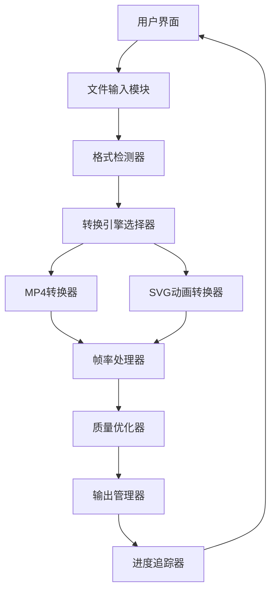

## Product Overview

增强现有SVG转换器，添加MP4视频格式和SVG动态格式的帧率转换功能，提供高质量无损输出和批量处理能力。

## Core Features

- MP4格式支持30/60/90/120帧率转换
- SVG动态格式支持30/40/60帧率转换
- 高质量无损转换输出
- 画面平滑优化算法
- 批量文件处理功能
- 实时转换进度显示
- 保持原始画质的转换引擎
- 帧率自适应调整

## Tech Stack

- Frontend: React + TypeScript + Tailwind CSS
- Media Processing: FFmpeg.js for video frame conversion
- SVG Animation: SVG.js + GSAP for dynamic SVG processing
- File Handling: File API + Web Workers for batch processing
- Progress Tracking: Web Workers + State Management
- UI Components: shadcn/ui for modern interface

## Architecture Design

### System Architecture



### Module Division

- **文件输入模块**: 处理文件上传、格式验证、批量文件管理
- **MP4转换器**: 使用FFmpeg.js进行视频帧率转换
- **SVG动画转换器**: 处理SVG动画帧率调整
- **帧率处理器**: 核心帧率转换算法实现
- **质量优化器**: 确保无损输出质量
- **进度追踪器**: 实时显示转换进度
- **输出管理器**: 处理文件下载和保存

### Data Flow


## Implementation Details

### Core Directory Structure

```
svg-converter-pro/
├── src/
│   ├── components/
│   │   ├── FileUploader.tsx
│   │   ├── ConverterPanel.tsx
│   │   ├── ProgressBar.tsx
│   │   └── BatchProcessor.tsx
│   ├── converters/
│   │   ├── MP4Converter.ts
│   │   ├── SVGAnimator.ts
│   │   └── FrameRateProcessor.ts
│   ├── utils/
│   │   ├── fileValidation.ts
│   │   ├── qualityOptimizer.ts
│   │   └── progressTracker.ts
│   └── workers/
│       ├── conversionWorker.ts
│       └── batchProcessorWorker.ts
├── public/
└── package.json
```

### Key Code Structures

```typescript
// 主要转换器接口
interface ConversionOptions {
  format: 'mp4' | 'svg-animated';
  frameRate: 30 | 40 | 60 | 90 | 120;
  quality: 'lossless' | 'high' | 'medium';
}

class FrameRateConverter {
  async convertMP4(file: File, options: ConversionOptions): Promise<Blob>
  async convertSVGAnimated(file: File, options: ConversionOptions): Promise<Blob>
  async batchConvert(files: File[], options: ConversionOptions): Promise<Blob[]>
}

// 进度追踪接口
interface ConversionProgress {
  current: number;
  total: number;
  percentage: number;
  currentFile: string;
}
```

### Technical Implementation Plan

1. **MP4帧率转换**: 集成FFmpeg.js，实现视频解码、帧插值、重新编码
2. **SVG动画帧率调整**: 使用SVG.js解析动画，调整duration和keyframes
3. **质量保证算法**: 实现无损压缩和画质保持策略
4. **批量处理优化**: 使用Web Workers实现并行处理
5. **进度追踪系统**: 实现实时进度更新和状态管理

## Technical Considerations

### Performance Optimization

- 使用Web Workers进行后台处理，避免阻塞主线程
- 实现分块处理大文件，减少内存占用
- 使用流式处理提高批量转换效率

### Security Measures

- 文件类型验证和大小限制
- 客户端文件处理，避免服务器安全隐患
- 用户数据本地处理，保护隐私

### Scalability

- 模块化设计，便于添加新的格式支持
- 可配置的转换参数，适应不同需求
- 插件式架构，支持功能扩展

## Design Style

采用现代化的专业设计风格，使用深色主题搭配霓虹蓝紫渐变色彩，体现科技感和专业性。界面布局清晰，操作流程直观，通过动画和过渡效果增强用户体验。

## Agent Extensions

### MCP

- **GitHub MCP Server**
- Purpose: 版本控制和代码管理，创建项目仓库并管理开发进度
- Expected outcome: 建立完整的项目版本控制，实现代码协作和版本追踪
- **Sequential Thinking MCP Server**
- Purpose: 复杂转换算法的逻辑分解和优化
- Expected outcome: 设计高效的帧率转换算法，优化转换流程
- **CloudBase AI ToolKit**
- Purpose: 云端处理能力和AI辅助优化
- Expected outcome: 提供云端转换服务，利用AI优化转换质量

### SubAgent

- **开发**
- Purpose: 编写生产就绪的转换器代码，确保代码质量和架构一致性
- Expected outcome: 实现高性能、可维护的转换功能模块
- **code-explorer**
- Purpose: 探索现有SVG转换器代码结构，集成新功能
- Expected outcome: 理解现有架构，无缝集成新的帧率转换功能