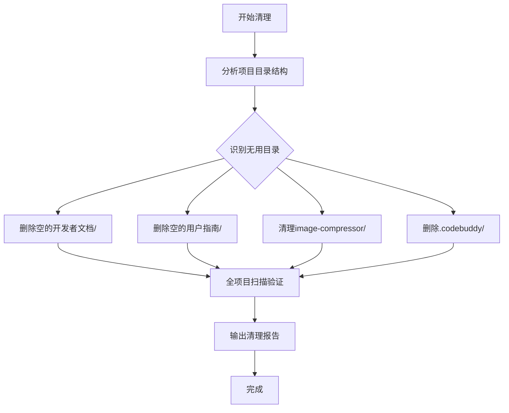

## Product Overview

项目文件结构清理任务，旨在删除无用的空目录、重复目录和临时文件，确保项目在上传Git前保持整洁规范。

## Core Features

- 删除根目录下空的`开发者文档/`和`用户指南/`目录（实际内容已在docs目录下）
- 清理`image-compressor/`目录中的旧重构文件和空目录
- 删除`.codebuddy/`配置目录
- 验证清理后的项目结构完整性

## Tech Stack

- 文件系统操作：使用Node.js的fs模块或命令行工具
- 版本控制：Git（用于准备提交前的清理）

## Tech Architecture

### 清理流程

## Implementation Details

### 清理操作清单

1. **根目录空目录清理**

- 删除 `开发者文档/` 目录
- 删除 `用户指南/` 目录

2. **image-compressor/目录清理**

- 删除旧的重构文件
- 删除空目录

3. **配置目录清理**

- 删除 `.codebuddy/` 目录

4. **验证步骤**

- 检查是否有遗漏的无用文件
- 确保docs目录内容完整

## Agent Extensions

### MCP

- **智文助手**
- Purpose: 分析项目文件夹结构和复杂性
- Expected outcome: 生成项目结构分析报告，识别需要清理的目录