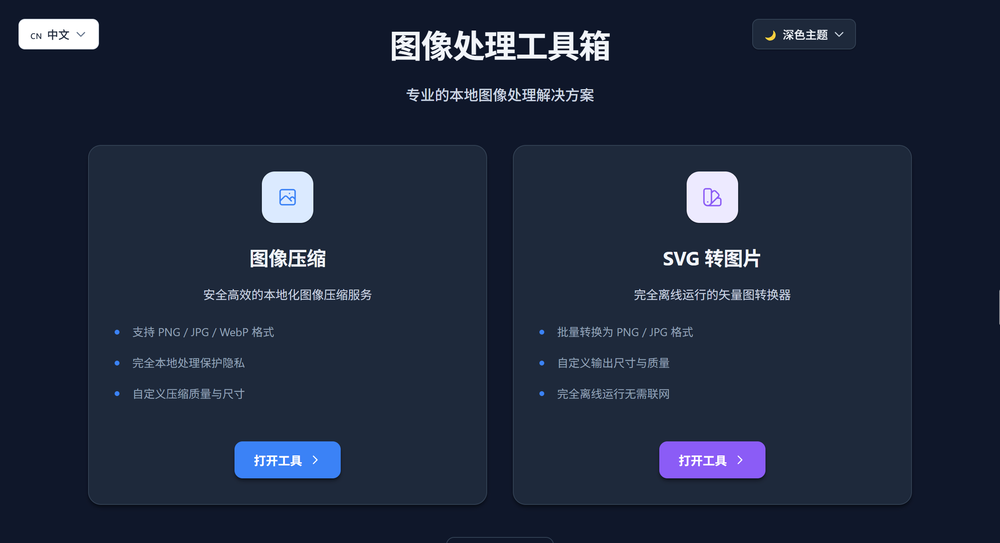
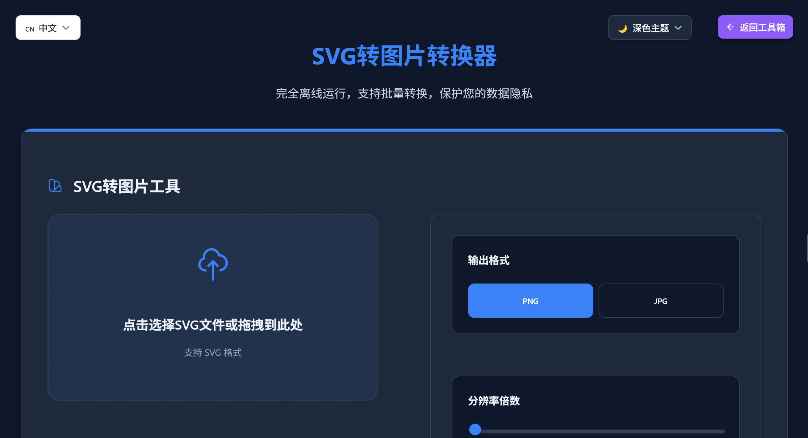

# 图像处理工具箱 - 浏览器插件

这是一个集成了图像压缩和SVG转图片功能的浏览器插件，提供安全、高效、完全本地化的图像处理解决方案。

---

## 功能展示

**主界面展示**：图像处理工具箱提供两个主要功能模块 - 图像压缩和SVG转图片，支持深色主题和返回主页按钮。

**图像压缩工具**：提供完整的压缩参数控制，包括质量调节、尺寸调整、格式选择等功能，支持多种图片格式。

**SVG转图片工具**：支持SVG文件上传和代码粘贴，提供多种输出格式和分辨率选项，完全离线运行。

---

## 功能特性

### 1. 图像压缩

- **支持格式**：PNG、JPG/JPEG、WebP、GIF、BMP、PPTX
- **压缩控制**：100级压缩质量调节（1-100）
- **尺寸调整**：自动、75%、50%、25%、1920px、1280px 六种预设
- **格式转换**：支持转换为 PNG、JPG、WebP、GIF、BMP 格式
- **批量处理**：支持多文件同时压缩，带进度显示
- **PPTX 支持**：可自动提取 PPTX 演示文稿中的图片进行压缩
- **实时预览**：压缩前后对比，显示文件大小和压缩率
- **智能去重**：自动识别重复图片，避免重复处理
- **完全本地**：所有处理在浏览器本地完成，无需上传服务器

### 2. SVG转图片

- **多种输入方式**：拖拽上传 SVG 文件、直接粘贴 SVG 代码
- **输出格式**：PNG、JPG
- **分辨率倍数**：1x（标准）、2x（2K）、3x（4K）、4x（8K）
- **质量控制**：1-10级质量调节（仅 JPG 格式）
- **批量转换**：支持多任务队列管理
- **实时预览**：转换过程中显示进度信息
- **安全处理**：自动清理 SVG 中的危险代码和标签
- **完全离线**：无需网络连接即可正常工作

### 3. 多语言支持

- 支持中文和英文界面切换
- 实时语言切换，无需刷新页面
- 自动保存用户语言偏好

### 4. 主题支持

- 浅色主题
- 深色主题
- 跟随系统主题
- 自动保存用户主题偏好

---

## 安装方法

### 系统要求

- **浏览器**：Chrome 88+、Edge 88+、Opera 74+ 或其他基于 Chromium 的浏览器
- **浏览器版本**：支持 Manifest V3 的浏览器版本
- **操作系统**：Windows、macOS、Linux 均可

### 在 Chrome 中安装

1. 下载或克隆此项目到本地
2. 打开 Chrome 浏览器
3. 在地址栏输入 `chrome://extensions/` 并回车
4. 开启右上角的「开发者模式」开关
5. 点击「加载已解压的扩展程序」
6. 选择 `图像处理游览器插件` 项目根目录
7. 插件将成功安装并出现在浏览器工具栏中

### 在 Edge 中安装

1. 打开 Edge 浏览器
2. 在地址栏输入 `edge://extensions/` 并回车
3. 开启「开发人员模式」
4. 点击「加载解压缩的扩展」
5. 选择项目目录并安装

### 在 Opera 中安装

1. 打开 Opera 浏览器
2. 在地址栏输入 `opera://extensions/` 并回车
3. 开启「开发者模式」
4. 点击「加载已解压的扩展」
5. 选择项目目录并安装

---

## 开源资源

- **[LICENSE](LICENSE)**：采用 MIT 开源协议
- **[CONTRIBUTING.md](CONTRIBUTING.md)**：如何参与项目开发
- **[CHANGELOG.md](CHANGELOG.md)**：详细的版本更新记录
- **[文档](docs/)**：用户指南和开发者文档

---

## 使用方法

### 启动插件

1. 点击浏览器工具栏中的插件图标
2. 将在独立标签页中打开主界面
3. 根据需求选择要使用的功能模块

### 图像压缩功能

#### 步骤一：上传图片

1. 选择「图像压缩」功能
2. 拖拽图片到上传区域
3. 或点击上传区域选择文件
4. 支持格式：PNG、JPG/JPEG、WebP、GIF、BMP、PPTX
5. **文件大小限制**：单文件最大 50MB（GIF 最大 20MB，PPTX 最大 100MB）
6. **批量上传**：可一次选择多个文件

#### 步骤二：调整压缩参数

1. **压缩质量**：拖动滑块调整（1-100 级）
   - 数值越高质量越好，文件越大
   - 数值越低压缩率越高，文件越小
   - 推荐值：80（平衡质量和大小）

2. **尺寸调整**：选择预设或输入自定义值
   - **自动**：保持原始尺寸
   - **75%**：缩小到原始尺寸的 75%
   - **50%**：缩小到原始尺寸的 50%
   - **25%**：缩小到原始尺寸的 25%
   - **1920px**：长边限制为 1920 像素，保持比例
   - **1280px**：长边限制为 1280 像素，保持比例

3. **输出格式**：选择目标格式
   - **PNG**：无损压缩，适合透明背景图片
   - **JPG**：有损压缩，适合照片类图片
   - **WebP**：现代格式，体积小质量好
   - **GIF**：适合简单动画
   - **BMP**：无损格式，文件较大

#### 步骤三：执行压缩

1. 点击「开始压缩」按钮
2. 等待压缩完成（批量文件将显示进度）
3. 查看压缩结果，包括：
   - 原始文件大小
   - 压缩后文件大小
   - 压缩率
   - 图片预览

#### 步骤四：下载结果

1. **单个下载**：点击每个结果项的「下载」按钮
2. **批量下载**：
   - 勾选需要下载的文件
   - 点击「全选」复选框可选中所有结果
   - 点击「批量下载」按钮
   - 查看下载进度，等待所有文件下载完成

### SVG转图片功能

#### 步骤一：添加SVG任务

1. 选择「SVG 转图片」功能
2. 通过两种方式添加SVG：
   - **方式一：文件上传**
     - 拖拽 SVG 文件到上传区域
     - 或点击上传区域选择文件
     - 支持批量选择多个 SVG 文件
   - **方式二：代码粘贴**
     - 直接在文本框中粘贴 SVG 代码
     - 点击「添加到任务列表」按钮
     - 支持批量添加多个 SVG 代码

#### 步骤二：设置转换参数

1. **输出格式**：选择 PNG 或 JPG
2. **分辨率倍数**：
   - 1x（标准）：保持原始尺寸
   - 2x（2K）：放大 2 倍
   - 3x（4K）：放大 3 倍
   - 4x（8K）：放大 4 倍
3. **图片质量**（仅 JPG 格式）：
   - 调节范围：1-10 级
   - 数值越高质量越好
   - 推荐值：6-8 级

#### 步骤三：批量转换

1. 点击「批量转换」按钮
2. 查看转换进度：
   - 当前处理的文件名
   - 已完成/总任务数
   - 当前任务进度
   - 总体进度条
3. 等待所有任务完成

#### 步骤四：批量下载

1. 所有转换完成后，点击「批量下载」按钮
2. 所有转换的图片将自动下载
3. 查看下载管理器确认完成

### PPTX文件处理

#### 自动提取图片

1. 上传 PPTX 演示文稿文件
2. 插件自动提取所有嵌入的图片
3. 自动排除系统图片和过小图片
4. 自动去重（通过文件哈希识别重复图片）
5. 智能提示发现重复时询问是否跳过

#### 批量压缩

1. 提取的图片自动进入压缩队列
2. 可以统一应用压缩设置处理所有图片
3. 支持批量下载所有处理结果

### 其他功能

#### 返回主界面

- 点击左上角「返回主页」按钮返回工具选择界面

#### 切换语言

1. 点击右上角语言切换按钮
2. 选择中文或 English
3. 界面即时切换，无需刷新页面
4. 自动保存用户语言偏好

#### 切换主题

1. 点击右上角主题切换按钮
2. 选择浅色主题、深色主题或跟随系统
3. 主题立即应用
4. 自动保存用户主题偏好

---

## 技术实现

### 核心技术栈

- **纯原生 JavaScript**：无框架依赖，轻量高效
- **Canvas API**：图像压缩和渲染
- **FileReader API**：文件读取和处理
- **Blob / URL.createObjectURL**：文件生成和下载
- **Web Crypto API**：加密和数据完整性校验
- **JSZip**：PPTX 文件解析和图片提取（第三方库）

### 模块化架构

#### 共享模块（shared/）

- **file-validator.js**：文件验证
  - 文件类型检查（MIME 类型 + 扩展名）
  - 文件大小限制
  - 魔数验证
  - 危险扩展名黑名单
  - 文件名检查

- **secure-storage.js**：安全存储
  - SHA-256 + XOR 混合加密方案
  - 数据完整性校验
  - 版本控制管理
  - 降级加密方案（Web Crypto API 不可用时）

- **svg-security.js**：SVG 安全处理
  - 危险标签过滤（script、iframe、object）
  - 危险属性过滤（onclick、onload）
  - XXE 攻击防护
  - SVG 炸弹检测

- **pptx-processor.js**：PPTX 处理
  - 图片提取（使用 JSZip）
  - 路径过滤（排除系统图片）
  - 哈希去重（SHA-256）
  - 最小尺寸过滤

- **resource-manager.js**：资源管理
  - 资源注册（URL、Canvas、Blob）
  - 自动释放（超时自动清理）
  - 定期清理（每 5 分钟）
  - 内存监控和泄漏防护

- **concurrency-controller.js**：并发控制
  - 任务队列管理
  - 并发限制（默认 3）
  - 优先级调度
  - 超时处理和取消
  - 重试机制（最多 2 次）

- **language-switch.js**：语言切换
  - 实时语言切换
  - 语言包管理
  - 本地存储偏好

- **theme-switch.js**：主题切换
  - 主题类应用
  - 系统主题检测
  - 本地存储偏好

### 性能优化

- **并发处理**：支持批量文件并行压缩，提升效率 50%
- **内存管理**：及时释放 Canvas、Blob 等资源，防止内存泄漏
- **进度显示**：实时显示处理进度，提升用户体验
- **智能去重**：自动识别重复图片，避免重复处理

---

## 隐私与安全

### 隐私保护承诺

- **完全本地处理**：所有图像处理操作在浏览器本地完成，不会上传任何数据到服务器
- **无数据收集**：插件不收集、存储或传输任何用户个人信息
- **离线可用**：无需网络连接即可正常使用所有功能
- **安全存储**：用户设置加密存储在本地浏览器中
- **透明性**：所有代码开源，可审查

### 安全特性

#### 文件验证

- **文件类型检查**：MIME 类型 + 扩展名双重验证
- **文件大小限制**：根据不同格式设置合理的大小限制
- **魔数验证**：通过文件头签名验证文件真实性
- **危险扩展名黑名单**：防止上传可执行文件
- **文件名检查**：特殊字符检测和长度限制
- **批量验证**：支持多文件批量验证

#### 安全存储

- **加密存储**：使用 SHA-256 和 XOR 混合加密方案
- **数据完整性校验**：生成校验码验证数据未被篡改
- **版本控制**：数据版本管理，兼容性处理
- **降级方案**：Web Crypto API 不可用时使用简单加密

#### SVG 安全处理

- **危险标签过滤**：移除 script、iframe、object 等危险标签
- **危险属性过滤**：过滤 onclick、onload 等事件处理器
- **XXE 防护**：防止 XML 外部实体注入攻击
- **SVG 炸弹检测**：限制元素数量和嵌套深度
- **动画限制**：防止恶意动画消耗资源

---

## 浏览器兼容性

| 浏览器 | 最低版本 | Manifest V3 支持 | 状态 |
|--------|----------|-------------------|------|
| Chrome | 88+ | ✅ 完全支持 |
| Edge | 88+ | ✅ 完全支持 |
| Opera | 74+ | ✅ 完全支持 |
| Brave | 88+ | ✅ 完全支持 |
| Vivaldi | 88+ | ✅ 完全支持 |
| Firefox | 109+ | ⚠️ 部分支持 |

---

## 常见问题

### 问题：图片无法上传

**解决方案：**
- 检查文件格式是否支持（PNG、JPG、WebP、GIF、BMP、PPTX）
- 检查文件大小是否超限（最大 50MB）
- 尝试在其他浏览器中打开文件，确认文件未损坏
- 刷新插件：在 `chrome://extensions/` 页面点击「刷新」按钮
- 查看控制台错误信息

### 问题：压缩后图片质量明显下降

**解决方案：**
- 提高压缩质量（使用 80-100 级）
- 避免过度压缩
- 选择合适的输出格式（PNG 适合透明图片）

### 问题：压缩后图片文件更大

**解决方案：**
- 使用 JPG 或 WebP 格式（有损压缩）
- 检查是否错误选择了放大尺寸
- 降低压缩质量（60-80 级）

### 问题：批量下载时部分文件失败

**解决方案：**
- 检查浏览器下载权限
- 检查磁盘可用空间
- 尝试单独下载失败的文件

### 问题：PPTX 文件无法上传

**解决方案：**
- 确认文件扩展名是 `.pptx`（非 .ppt）
- 使用最新版本的 PowerPoint 保存文件
- 尝试在其他软件中打开文件

---

## 项目文档

- **[用户指南](docs/用户指南/)**：快速开始、功能说明、常见问题
- **[开发者文档](docs/开发者文档/)**：项目结构、开发指南、API 文档
- **[贡献指南](CONTRIBUTING.md)**：如何参与项目开发
- **[变更日志](CHANGELOG.md)**：详细的版本更新记录

---

## 版本记录

当前版本：[v1.1.0](CHANGELOG.md)（2026 年 1 月）

查看详细的版本更新历史：[CHANGELOG.md](CHANGELOG.md)

---

## 贡献

欢迎贡献代码、报告问题或提出功能建议！

- [提交 Issue](https://github.com/kscz0000/OLBrowser-Plugin/issues)：报告 Bug 或功能请求
- [Pull Request](https://github.com/kscz0000/OLBrowser-Plugin/pulls)：提交代码更改
- 查看[贡献指南](CONTRIBUTING.md)了解开发流程

---

## 联系方式

- **项目仓库**：[https://github.com/kscz0000/OLBrowser-Plugin](https://github.com/kscz0000/OLBrowser-Plugin)
- **问题反馈**：在 GitHub Issues 中提交问题报告
- **功能建议**：在 GitHub Issues 中提出功能请求

---

**最后更新**：2026 年 1 月
