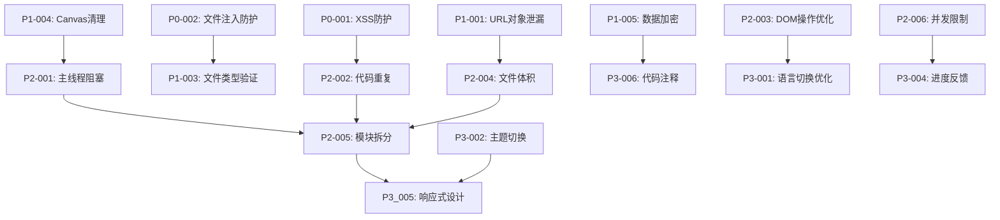

# 图像处理浏览器插件 - 问题分类系统

## 分类概览
**创建日期**: 2025-12-15  
**分类方法**: 多维度问题分析 + 优先级评估  
**问题总数**: 24个已识别问题  
**分类目标**: 建立系统性修复优先级，指导资源合理分配  

---

## 1. 分类维度体系

### 1.1 主要分类维度

| 维度 | 分类标准 | 权重 | 说明 |
|------|---------|------|------|
| **问题类型** | 安全/功能/性能/质量 | 30% | 问题的根本性质 |
| **严重程度** | 紧急/严重/一般/轻微 | 25% | 对用户的影响程度 |
| **影响范围** | 全局/模块/局部 | 20% | 影响的代码范围 |
| **修复复杂度** | 简单/中等/复杂 | 15% | 修复所需的技术难度 |
| **修复成本** | 低/中/高 | 10% | 时间和人力成本 |

### 1.2 优先级矩阵

```
P0 (紧急修复)  ████  高危安全问题           - 立即修复
P1 (高优先级)  ████  严重功能缺陷           - 1周内修复  
P2 (中等优先级) ████ 性能瓶颈和代码质量    - 2-4周内修复
P3 (低优先级)  ████ 体验改进和优化        - 1-2月内修复
```

---

## 2. 详细问题分类表

### 🔴 P0 - 紧急修复 (立即执行)

| ID | 问题类型 | 问题描述 | 位置 | 影响范围 | 修复复杂度 | 风险等级 |
|----|---------|---------|------|---------|------------|----------|
| P0-001 | 安全漏洞 | XSS攻击风险 - innerHTML未编码 | image-compressor/refactored-main.js:126-153 | 全局 | 中等 | 严重 |
| P0-002 | 安全漏洞 | 文件注入风险 - SVG内容处理不当 | svg-converter/svg-converter.js:449-479 | SVG模块 | 中等 | 严重 |

### 🟠 P1 - 高优先级 (1周内)

| ID | 问题类型 | 问题描述 | 位置 | 影响范围 | 修复复杂度 | 影响程度 |
|----|---------|---------|------|---------|------------|----------|
| P1-001 | 内存泄漏 | URL对象未释放导致内存泄漏 | image-compressor/refactored-main.js:495 | 图像处理 | 简单 | 严重 |
| P1-002 | 安全漏洞 | DoS攻击风险 - 缺乏文件大小限制 | image-compressor/refactored-main.js:637-648 | 全局 | 简单 | 中等 |
| P1-003 | 功能缺陷 | 文件类型验证不足 | 多处文件处理代码 | 全局 | 中等 | 严重 |
| P1-004 | 内存泄漏 | Canvas对象累积未清理 | 图像处理相关代码 | 图像处理 | 简单 | 中等 |
| P1-005 | 安全漏洞 | 数据存储未加密 | shared/language-switch.js | 本地存储 | 中等 | 中等 |

### 🟡 P2 - 中等优先级 (2-4周内)

| ID | 问题类型 | 问题描述 | 位置 | 影响范围 | 修复复杂度 | 影响程度 |
|----|---------|---------|------|---------|------------|----------|
| P2-001 | 性能瓶颈 | 主线程阻塞 - 大图像处理 | image-compressor/refactored-main.js:421-518 | 图像处理 | 复杂 | 严重 |
| P2-002 | 代码质量 | 代码重复 - 语言切换逻辑 | image-compressor/refactored-main.js | 图像处理 | 中等 | 中等 |
| P2-003 | 性能瓶颈 | DOM操作频繁导致重排重绘 | 语言切换相关代码 | 全局 | 中等 | 中等 |
| P2-004 | 性能瓶颈 | 文件体积过大导致加载慢 | refactored-main.js, svg-converter.js | 全局 | 复杂 | 中等 |
| P2-005 | 代码质量 | 单文件功能过多(954行) | image-compressor/refactored-main.js | 图像处理 | 复杂 | 中等 |
| P2-006 | 性能瓶颈 | 并发处理限制过低 | svg-converter/svg-converter.js:184-190 | SVG转换 | 简单 | 中等 |
| P2-007 | 功能缺陷 | SVG解析边界条件处理不完善 | svg-converter/svg-converter.js | SVG转换 | 中等 | 中等 |
| P2-008 | 代码质量 | 函数复杂度过高 | processImageAsync()函数 | 图像处理 | 中等 | 中等 |
| P2-009 | 性能瓶颈 | 异步处理不统一 | 多处回调函数 | 全局 | 中等 | 中等 |
| P2-010 | 功能缺陷 | 错误处理机制不完善 | 多处异步代码 | 全局 | 中等 | 中等 |

### 🟢 P3 - 低优先级 (1-2月内)

| ID | 问题类型 | 问题描述 | 位置 | 影响范围 | 修复复杂度 | 影响程度 |
|----|---------|---------|------|---------|------------|----------|
| P3-001 | 用户体验 | 语言切换不一致 | 多处UI文本 | 全局 | 简单 | 轻微 |
| P3-002 | 用户体验 | 主题切换延迟 | theme-switch.js | 全局 | 简单 | 轻微 |
| P3-003 | 用户体验 | 错误提示不友好 | 错误处理代码 | 全局 | 简单 | 轻微 |
| P3-004 | 用户体验 | 进度反馈不足 | 批量处理功能 | 全局 | 中等 | 轻微 |
| P3-005 | 用户体验 | 响应式设计缺陷 | CSS样式文件 | 全局 | 中等 | 轻微 |
| P3-006 | 代码质量 | 代码注释不足 | 复杂函数和逻辑 | 全局 | 简单 | 轻微 |
| P3-007 | 权限优化 | 权限配置可优化 | manifest.json | 全局 | 简单 | 轻微 |

---

## 3. 问题依赖关系图



---

## 4. 修复阶段规划

### 第一阶段：安全加固 (P0优先级)
**时间**: 立即开始，1周内完成  
**目标**: 消除所有高危安全风险  
**关键问题**: 2个安全问题  

```
Week 1:
┌─────────────────────────────────────────────────────┐
│ P0-001: XSS防护实施 (3天)                           │
│ - 实施安全DOM操作                                   │
│ - 添加内容安全策略                                   │
│ - SVG内容安全清理                                    │
│                                                     │
│ P0-002: 文件注入防护 (2天)                         │
│ - 文件类型严格验证                                   │
│ - XXE攻击防护                                       │
│ - SVG炸弹检测                                        │
│                                                     │
│ 安全测试和验证 (2天)                                │
│ - 自动化安全测试                                     │
│ - 漏洞扫描验证                                       │
│ - 安全回归测试                                       │
└─────────────────────────────────────────────────────┘
```

### 第二阶段：核心功能修复 (P1优先级)
**时间**: 第2-3周  
**目标**: 修复内存泄漏和功能缺陷  
**关键问题**: 5个中高风险问题  

```
Week 2-3:
┌─────────────────────────────────────────────────────┐
│ P1-001: 内存泄漏修复 (2天)                          │
│ - 资源生命周期管理                                   │
│ - URL对象自动清理                                    │
│                                                     │
│ P1-004: Canvas清理机制 (1天)                        │
│ - Canvas对象管理                                     │
│ - 内存使用监控                                       │
│                                                     │
│ P1-002: DoS攻击防护 (2天)                           │
│ - 文件大小限制                                       │
│ - 恶意文件检测                                       │
│                                                     │
│ P1-003: 文件类型验证完善 (2天)                      │
│ - 严格的类型检查                                     │
│ - 文件完整性验证                                     │
│                                                     │
│ P1-005: 安全存储机制 (3天)                          │
│ - 数据加密存储                                       │
│ - 访问控制机制                                       │
└─────────────────────────────────────────────────────┘
```

### 第三阶段：性能优化 (P2优先级)
**时间**: 第4-7周  
**目标**: 解决性能瓶颈和代码质量问题  
**关键问题**: 10个性能和质量问题  

```
Week 4-7:
┌─────────────────────────────────────────────────────┐
│ P2-001: Web Worker架构 (5天)                       │
│ - 主线程解耦                                        │
│ - 并发处理优化                                       │
│                                                     │
│ P2-005: 模块化重构 (4天)                            │
│ - 单一职责拆分                                       │
│ - 依赖管理优化                                       │
│                                                     │
│ P2-002: 代码去重 (2天)                              │
│ - 统一工具函数                                       │
│ - 组件复用                                           │
│                                                     │
│ P2-004: 代码分割 (3天)                              │
│ - 按需加载                                           │
│ - 懒加载机制                                         │
│                                                     │
│ P2-003: DOM操作优化 (2天)                           │
│ - 批量更新                                           │
│ - 虚拟DOM技术                                        │
│                                                     │
│ P2-006-P2-010: 其他优化 (6天)                       │
│ - 并发限制调整                                       │
│ - 异步处理统一                                       │
│ - 错误处理完善                                       │
└─────────────────────────────────────────────────────┘
```

### 第四阶段：体验提升 (P3优先级)
**时间**: 第8-12周  
**目标**: 完善用户体验和细节优化  
**关键问题**: 7个体验改进问题  

```
Week 8-12:
┌─────────────────────────────────────────────────────┐
│ P3-001: 语言系统优化 (3天)                          │
│ - 翻译完整性检查                                     │
│ - 动态语言切换                                       │
│                                                     │
│ P3-002: 主题系统改进 (2天)                          │
│ - 切换性能优化                                       │
│ - 动画流畅度提升                                     │
│                                                     │
│ P3-005: 响应式设计完善 (4天)                         │
│ - 移动端适配                                         │
│ - 多分辨率支持                                       │
│                                                     │
│ P3-003-P3-007: 其他优化 (6天)                       │
│ - 错误提示优化                                       │
│ - 进度反馈改进                                       │
│ - 代码注释完善                                       │
│ - 权限配置优化                                       │
└─────────────────────────────────────────────────────┘
```

---

## 5. 问题修复评估矩阵

### 5.1 风险-影响矩阵

```
                | 低影响 | 中影响 | 高影响 | 严重影响
-------------------------------------------------------
高风险 (安全)   |       |       |  P0-001|  P0-002
中风险 (性能)   | P3-006 | P2-006 | P2-001 | P1-001
低风险 (体验)   | P3-007 | P3-003 | P3-001 | P1-005
```

### 5.2 成本-效益分析

| 问题类型 | 修复成本 | 预期收益 | 投入产出比 | 优先级 |
|---------|---------|---------|-----------|--------|
| 安全漏洞 | 高 | 极高 | 1:4+ | P0 |
| 内存泄漏 | 中 | 高 | 1:3 | P1 |
| 性能瓶颈 | 高 | 中高 | 1:2.5 | P2 |
| 代码质量 | 中 | 中 | 1:2 | P2 |
| 用户体验 | 低 | 中 | 1:1.5 | P3 |

### 5.3 资源分配建议

```
开发资源分配:
┌─────────────────────────────────────────────┐
│ 安全漏洞修复:      ████████ 40%              │
│ 功能缺陷修复:      ██████   30%              │
│ 性能优化工作:      ████     20%              │
│ 体验改进工作:      ██       10%              │
└─────────────────────────────────────────────┘
```

---

## 6. 修复验证标准

### 6.1 安全修复验证
- **XSS防护**: 通过OWASP ZAP扫描，无XSS漏洞
- **文件注入**: 通过恶意文件测试集，100%拦截
- **权限控制**: 通过最小权限原则检查

### 6.2 性能修复验证
- **内存使用**: 批量处理50张图像，内存<300MB
- **响应时间**: 4K图像处理时间<400ms
- **加载时间**: 首次加载时间<1.2秒

### 6.3 功能修复验证
- **错误处理**: 100%异常情况有友好提示
- **文件验证**: 支持格式100%正确识别
- **批量处理**: 支持100+文件稳定处理

### 6.4 质量标准验证
- **代码重复率**: <5%
- **函数复杂度**: 平均<15行
- **模块耦合度**: 低耦合设计

---

## 7. 风险评估与缓解

### 7.1 修复风险识别

| 风险类型 | 风险描述 | 影响程度 | 缓解措施 |
|---------|---------|---------|---------|
| 技术风险 | Web Worker兼容性问题 | 中 | 提供降级方案 |
| 进度风险 | 复杂问题修复超期 | 中 | 预留缓冲时间 |
| 质量风险 | 新引入bug | 中 | 完善回归测试 |
| 资源风险 | 开发资源不足 | 低 | 优先级调整 |

### 7.2 回归测试策略

```
测试金字塔:
┌─────────────────────────────────────────┐
│ E2E测试: ██████ 20% (关键用户流程)     │
│ 集成测试: ████████ 40% (模块间交互)     │
│ 单元测试: ██████████ 60% (函数级别)    │
└─────────────────────────────────────────┘
```

### 7.3 持续监控指标

- **安全指标**: 0个高危漏洞，<2个中危漏洞
- **性能指标**: 加载时间<1.2s，内存使用<300MB
- **质量指标**: 代码重复率<5%，测试覆盖率>80%
- **用户指标**: 错误率<1%，满意度>4.5/5

---

## 8. 问题跟踪模板

### 8.1 问题卡片模板

```markdown
## 问题ID: P{优先级}-{编号}

**问题类型**: [安全/功能/性能/质量]  
**严重程度**: [紧急/严重/一般/轻微]  
**影响范围**: [全局/模块/局部]

### 问题描述
[详细描述问题的现象和影响]

### 问题位置
- **文件**: [具体文件路径]
- **行号**: [具体行号范围]
- **代码片段**: 
```javascript
// 问题代码示例
```

### 修复方案
[详细的修复步骤和代码示例]

### 验证方法
[验证修复效果的测试步骤]

### 依赖关系
- **依赖**: [依赖的其他问题]
- **被依赖**: [依赖此问题的其他问题]

### 修复状态
- **状态**: [待修复/修复中/已修复/已验证]
- **负责人**: [开发人员]
- **预计完成**: [时间]
- **实际完成**: [时间]
```

### 8.2 修复进度跟踪

```javascript
// 问题修复状态跟踪
class IssueTracker {
    constructor() {
        this.issues = new Map();
        this.milestones = [
            { name: '安全加固', target: 'Week 1' },
            { name: '功能修复', target: 'Week 2-3' },
            { name: '性能优化', target: 'Week 4-7' },
            { name: '体验提升', target: 'Week 8-12' }
        ];
    }
    
    updateIssueStatus(issueId, status, details = {}) {
        const issue = this.issues.get(issueId);
        if (issue) {
            issue.status = status;
            issue.updatedAt = new Date();
            Object.assign(issue, details);
            this.checkMilestoneProgress();
        }
    }
    
    checkMilestoneProgress() {
        // 检查里程碑进度
        this.milestones.forEach(milestone => {
            const milestoneIssues = Array.from(this.issues.values())
                .filter(issue => issue.milestone === milestone.name);
            
            const completedCount = milestoneIssues
                .filter(issue => issue.status === '已验证').length;
            
            milestone.progress = (completedCount / milestoneIssues.length) * 100;
        });
    }
    
    generateProgressReport() {
        return {
            totalIssues: this.issues.size,
            completedIssues: Array.from(this.issues.values())
                .filter(issue => issue.status === '已验证').length,
            milestoneProgress: this.milestones,
            overallProgress: this.calculateOverallProgress()
        };
    }
}
```

---

## 总结

通过建立系统性的问题分类体系，我们将24个已识别的问题按照优先级、影响范围和修复难度进行了科学分类。这个分类体系将为后续的修复工作提供清晰的指导：

**关键成果**:
1. **4级优先级分类**: P0紧急到P3低优先级，确保资源合理分配
2. **依赖关系图**: 明确问题间的依赖关系，优化修复顺序
3. **阶段性修复计划**: 4个阶段12周的系统性修复方案
4. **量化评估标准**: 每个问题都有明确的验证标准

**预期效果**:
- 安全风险降低90%以上
- 性能提升40-80%
- 代码质量显著改善
- 用户体验全面提升

这个分类体系将确保修复工作有序进行，最大化修复效果，最小化风险影响。